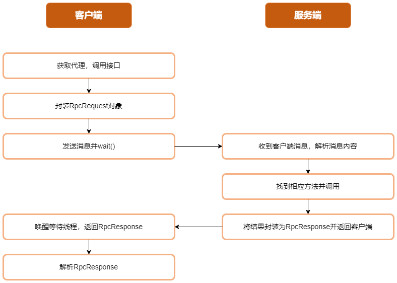

# 1.简介

这是一个基于`netty`实现的简易`RPC`框架，其工作流程如下图所示：



服务端实现了一个自定义的注解`@RpcService`，使用时只需要在要提供远程服务的类上加上它就行

在实例化的时候会找到所有带`@RpcService`的类实例化并存储到一个`map`中

当收到客户端请求时，会解析出请求的方法参数和参数类型在这个`map`中查找相应的方法并调用

客户端`NettyClientHandler`实现了`Callable`方法，提交到线程池会调用其中的`call`方法，`call`方法中向服务端发送请求,利用线程唤醒等待实现同步的效果，发送消息后`wait()`，等到服务端返回消息后`notify()`，并将`response`返回

# 2.启动方法

项目为标准的`Maven`项目

`provider`下为服务端代码，执行`NettyRpcServer`中的`main`函数即可启动服务端，服务端启动方式如下

```java
public static void main(String[] args) {
    NettyRpcServer server = new NettyRpcServer();
    server.start("127.0.0.1", 8000);
}
```

`consumer`文件夹下为客户端代码，执行`NettyClientServer`中的`main`函数即可启动客户端，客户端启动方式如下

```java
public static void main(String[] args) {
    /* 此处为服务端ip和端口 */
    NettyRpcClient rpcClient = new NettyRpcClient("127.0.0.1",8000);
    /* Translator为用于演示的接口 */
    Translator translator = (Translator)rpcClient.getProxy(Translator.class);
    System.out.println(translator.translate("food"));
    System.out.println(translator.translate("English"));
    System.out.println(translator.translate("cmn"));
}
```
