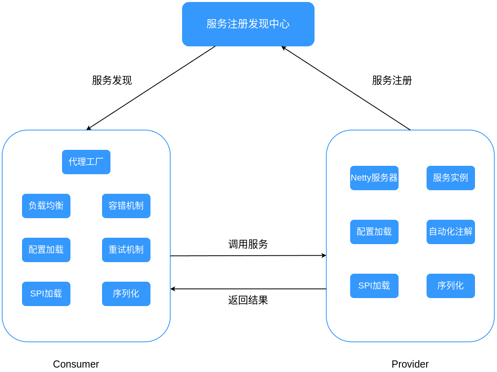

# 基于Netty+Zookeeper的高可用RPC框架

## 1.项目简介

`RPC(Remote Procedure Call)`，即远程过程调用，可以让用户像调用本地方法一样调用远程方法。

本博客将详细介绍从0开发RPC框架的过程，源码地址：<a href="https://github.com/543211494/MyRpc">https://github.com/543211494/MyRpc</a>

以下是整个项目的结构示意图：

项目特点：

- 基于`Netty`实现服务器，实现服务端与客户端的高性能通信
- 客户端基于jdk动态代理为服务接口生成可发送网络请求的代理对象，实现远程方法的透明调用
- 利用反射实现自动化注解，服务端启动时可自动实例化服务对象存储于`ConcurrentHashMap`中
- 使用`Hutool`实现全局配置加载，所有配置均有默认值，用户可通过`.properties`修改配置
- 使用`zookeeper`作为注册中心，即使连接意外断开，临时节点也会被自动删除
- 客户端实现了多种负载均衡、重试和容错策略，可通过配置文件选择使用，提高框架可用性
- 利用反射实现`SPI`机制，用户可选择或自定义负载均衡、重试和容错策略，提高框架拓展性

下面我们开始第一节，实现一个`RPC`的基本功能：<a href="./rpc-00.md">RPC基本功能的实现</a>