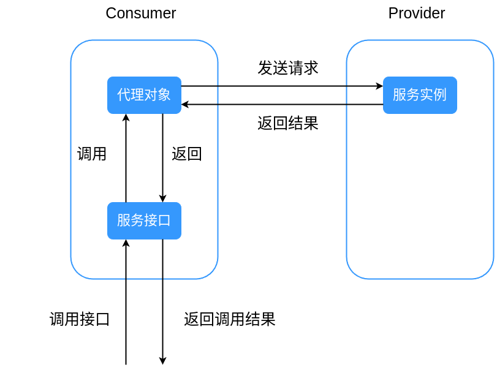
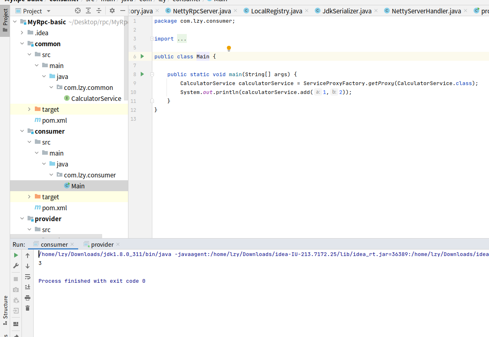

# RPC基本功能的实现

该部分的源码地址：<a href="https://github.com/543211494/MyRpc/tree/MyRpc-basic">https://github.com/543211494/MyRpc/tree/MyRpc-basic</a>

下一章：<a href="./rpc-02.md">自动注解与全局配置文件的实现</a>

## 1.实现目标

现有一个公开的接口定义，服务端实现了该接口，客户端想像调用本地方法一样调用服务端的实现。这就是`RPC`要实现的基本功能。

```java
public interface CalculatorService {

    /**
     * 加法
     */
    public int add(int a,int b);
}
```

## 2.动态代理

如何让用户透明地调用远程方法呢？

RPC框架中的解决方案是在客户端为服务接口实现一个代理对象，当调用接口方法时，实际上会调用代理对象的`invoke`方法，由代理对象向服务端发生网络请求，并解析服务端返回的结果作为接口方法的返回值。这样一来，用户就像调用本地方法一样调用接口方法。



下面我们使用jdk动态代理来实现

动态代理类

```java
public class ServiceProxy implements InvocationHandler {

    /**
     * 序列化类
     */
    private static final Serializer serializer = new JdkSerializer();

    @Override
    public Object invoke(Object proxy, Method method, Object[] args) throws Throwable {
        /* 构造rpc倾请求 */
        RpcRequest rpcRequest = new RpcRequest();
        /* 获取被调用方法所属接口的名称及路径 */
        rpcRequest.setServiceName(method.getDeclaringClass().getName());
        /* 获取被调用方法的方法名 */
        rpcRequest.setMethodName(method.getName());
        /* 获取被调用方法 */
        rpcRequest.setParameterTypes(method.getParameterTypes());
        rpcRequest.setArgs(args);

        try {
            /* 序列化 */
            byte[] data = serializer.serialize(rpcRequest);
            /* 发送请求，此处暂时将路径写死，待后续实现服务注册/发现中心后修改 */
            try (HttpResponse httpResponse = HttpRequest.post("http://127.0.0.1:8080")
                    .body(data)
                    .execute()) {
                byte[] result = httpResponse.bodyBytes();
                // 反序列化
                RpcResponse rpcResponse = serializer.deserialize(result, RpcResponse.class);
                return rpcResponse.getData();
            }
        } catch (IOException e) {
            e.printStackTrace();
        }
        return null;
    }
}
```

配合代理工厂，用户可以为任意接口实现代理类，以下是代理工厂的实现

```java
public class ServiceProxyFactory {

    /**
     * 根据服务类获取代理对象
     *
     * @param serviceClass  被代理接口的class
     * @return 代理对象
     */
    public static <T> T getProxy(Class<T> serviceClass) {
        return (T) Proxy.newProxyInstance(
                serviceClass.getClassLoader(),
                new Class[]{serviceClass},
                new ServiceProxy());
    }
}
```

## 3.序列化工具类

在上述代码中，我们不能将本地的对象直接发送给服务端，因此需要序列化和反序列化

先定义一个序列化接口方面日后拓展

```java
public interface Serializer {

    /**
     * 序列化
     */
    <T> byte[] serialize(T object) throws IOException;

    /**
     * 反序列化
     */
    <T> T deserialize(byte[] bytes, Class<T> type) throws IOException;
}
```

目前框架中基于`java`原生的`ByteArray`实现序列化

```java
public class JdkSerializer implements Serializer {

    /**
     * 序列化
     */
    @Override
    public <T> byte[] serialize(T object) throws IOException {
        ByteArrayOutputStream outputStream = new ByteArrayOutputStream();
        ObjectOutputStream objectOutputStream = new ObjectOutputStream(outputStream);
        objectOutputStream.writeObject(object);
        objectOutputStream.close();
        return outputStream.toByteArray();
    }

    /**
     * 反序列化
     */
    @Override
    public <T> T deserialize(byte[] bytes, Class<T> type) throws IOException {
        ByteArrayInputStream inputStream = new ByteArrayInputStream(bytes);
        ObjectInputStream objectInputStream = new ObjectInputStream(inputStream);
        try {
            return (T) objectInputStream.readObject();
        } catch (ClassNotFoundException e) {
            throw new RuntimeException(e);
        } finally {
            objectInputStream.close();
        }
    }
}
```

## 4.Netty服务器

服务端基于`Netty`为客户端提供服务，因此我们需要先启动`Netty`，以下为`Netty`启动类

```java
public class NettyRpcServer {

    public void start(int port){
        /* 创建bossGroup和workeGroup */
        EventLoopGroup bossGroup = new NioEventLoopGroup(1);
        EventLoopGroup workerGroup = new NioEventLoopGroup();
        try {
            ServerBootstrap serverBootstrap = new ServerBootstrap();
            serverBootstrap.group(bossGroup, workerGroup)
                    .channel(NioServerSocketChannel.class)
                    .childHandler(new ChannelInitializer<SocketChannel>() {
                                      @Override
                                      protected void initChannel(SocketChannel ch) throws Exception {
                                          ChannelPipeline pipeline = ch.pipeline();
                                          /* 加入一个netty提供的编/解码器 */
                                          pipeline.addLast(new HttpServerCodec());
                                          /* 用于将HTTP消息片段聚合为完整的FullHttpRequest或FullHttpResponse */
                                          pipeline.addLast(new HttpObjectAggregator(65536));
                                          /* 自定义的业务处理器 */
                                          pipeline.addLast(new NettyServerHandler());
                                      }
                                  }
                    );
            /* 绑定ip和端口号 */
            ChannelFuture channelFuture = serverBootstrap.bind(port).sync();
            channelFuture.channel().closeFuture().sync();
        } catch (Exception e) {
            e.printStackTrace();
        } finally {
            bossGroup.shutdownGracefully();
            workerGroup.shutdownGracefully();
        }
    }
}
```

在`pipeline`中加入编解码器和自定义的`Handler`，当`pipeline`是责任链的一种应用，我们自定义的`Handler`会被自动调用处理业务逻辑。以下是`NettyServerHandler`的具体实现：

```java
public class NettyServerHandler extends SimpleChannelInboundHandler<FullHttpRequest> {

    private static final Serializer serializer = new JdkSerializer();

    /**
     * 收到消息时调用该方法
     */
    @Override
    protected void channelRead0(ChannelHandlerContext channelHandlerContext, FullHttpRequest fullHttpRequest) throws Exception {
        ByteBuf buffer = fullHttpRequest.content();
        byte[] data = new byte[buffer.readableBytes()];
        buffer.readBytes(data);
        RpcRequest rpcRequest = serializer.deserialize(data,RpcRequest.class);
        // 构造响应结果对象
        RpcResponse rpcResponse = new RpcResponse();
        // 如果请求为 null，直接返回
        if (rpcRequest == null) {
            rpcResponse.setMessage("rpcRequest is null");
        }else{
            /* 通过反射调用相应的方法 */
            Class<?> clazz = LocalRegistry.get(rpcRequest.getServiceName());
            Method method = clazz.getMethod(rpcRequest.getMethodName(), rpcRequest.getParameterTypes());
            Object result = method.invoke(clazz.newInstance(), rpcRequest.getArgs());
            /* 封装返回结果 */
            rpcResponse.setData(result);
            rpcResponse.setDataType(method.getReturnType());
            rpcResponse.setMessage("ok");
        }
        FullHttpResponse response = new DefaultFullHttpResponse(HttpVersion.HTTP_1_1, HttpResponseStatus.OK);
        response.content().writeBytes(serializer.serialize(rpcResponse));
        /* 设置响应头 */
        response.headers().set(HttpHeaderNames.CONTENT_TYPE, "text/plain");
        response.headers().set(HttpHeaderNames.CONTENT_LENGTH, response.content().readableBytes());
        channelHandlerContext.writeAndFlush(response);
    }

    /**
     * 触发异常时调用该方法关闭连接
     */
    @Override
    public void exceptionCaught(ChannelHandlerContext ctx, Throwable cause) throws Exception {
        ctx.close();
    }
}
```

从上述代码我们可以看到，当服务端收到请求时，会解析其中的接口名、方法名、方法参数类型和方法参数，并根据这些信息找到提供服务的类，实例化并执行对应的方法。因此我们需要一个本地的注册中心提前将提供服务的类相关信息注册以便查询。下一小节将对注册中心（不是后面的服务注册/发现中心）展开介绍。

## 5.服务对象注册中心

在服务端启动时，我们可以手动将提供服务的类的相关信息存储在一个`ConcurrentHashMap`中，其中`key`为接口名称，`value`为实现类的类型

```java
/**
 * 本地注册中心
 */
public class LocalRegistry {

    /**
     * 注册信息存储
     */
    private static final Map<String, Class<?>> map = new ConcurrentHashMap<>();

    /**
     * 注册服务
     */
    public static void register(String serviceName, Class<?> implClass) {
        map.put(serviceName, implClass);
    }

    /**
     * 获取服务
     */
    public static Class<?> get(String serviceName) {
        return map.get(serviceName);
    }

    /**
     * 删除服务
     */
    public static void remove(String serviceName) {
        map.remove(serviceName);
    }
}

```

## 6.运行程序

至此，我们已经实现了`RPC`的基本功能，让我们来运行程序看看

项目为标准的`Maven`项目

`provider`下为服务端代码，执行其中的`main`函数即可启动服务端，服务端启动方式如下

```java
public static void main(String[] args) {
    /**
     * 注册提供服务的实体类
     */
    LocalRegistry.register(CalculatorService.class.getName(),CalculatorServiceImpl.class);
    NettyRpcServer server = new NettyRpcServer();
    server.start(8080);
}
```

`consumer`文件夹下为客户端代码，通过代理工厂获取代理类，从而调用服务端的远程方法

```java
public static void main(String[] args) {
    CalculatorService calculatorService = ServiceProxyFactory.getProxy(CalculatorService.class);
    System.out.println(calculatorService.add(1,2));
}
```

先启动服务端，再启动客户端，项目运行结果如下



## 附录：项目文件结构

```
├── common   公共接口，用于演示用法
│   ├── pom.xml
│   └── src
│       ├── main
│       │   └── java
│       │       └── com
│       │           └── lzy
│       │               └── common
│       │                   └── CalculatorService.java
│       └── test
│           └── java
├── consumer  客户端，用于演示用法
│   ├── pom.xml
│   └── src
│       ├── main
│       │   └── java
│       │       └── com
│       │           └── lzy
│       │               └── consumer
│       │                   └── Main.java
│       └── test
│           └── java
├── pom.xml
├── provider  服务端，用于演示用法
│   ├── pom.xml
│   └── src
│       ├── main
│       │   └── java
│       │       └── com
│       │           └── lzy
│       │               └── provider
│       │                   ├── CalculatorServiceImpl.java
│       │                   └── Main.java
│       └── test
│           └── java
├── README.md
└── rpc-core   rpc核心实现，被客户端和服务端调用
    ├── pom.xml
    └── src
        ├── main
        │   └── java
        │       └── com
        │           └── lzy
        │               └── rpc
        │                   ├── bean  请求回复实体类
        │                   │   ├── RpcRequest.java
        │                   │   └── RpcResponse.java
        │                   ├── consumer  客户端调用部分
        │                   │   └── proxy  客户端代理类及代理工厂
        │                   │       ├── ServiceProxyFactory.java
        │                   │       └── ServiceProxy.java
        │                   ├── provider  服务端调用部分
        │                   │   ├── registry  本地map注册中心(待升级)
        │                   │   │   └── LocalRegistry.java
        │                   │   └── server  netty服务器
        │                   │       ├── NettyRpcServer.java
        │                   │       └── NettyServerHandler.java
        │                   └── util  序列化类
        │                       ├── JdkSerializer.java
        │                       └── Serializer.java
        └── test
            └── java
```
