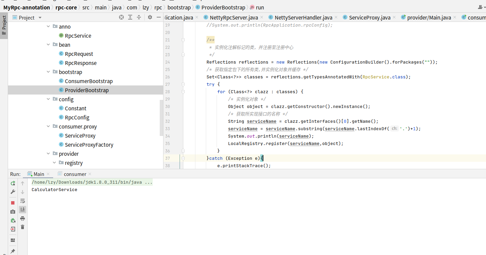

# 自动注解与全局配置文件的实现

该部分的源码地址：<a href="https://github.com/543211494/MyRpc/tree/MyRpc-annotation">https://github.com/543211494/MyRpc/tree/MyRpc-annotation</a>

下一章：<a href="./rpc-03.md">服务注册/发现中心的实现</a>

## 1.自动注解

上个版本中，我们在服务端采用了手动注册服务对象的方法，未免有些麻烦

```java
public static void main(String[] args) {
    /**
     * 注册提供服务的实体类
     */
    LocalRegistry.register(CalculatorService.class.getName(),CalculatorServiceImpl.class);
    NettyRpcServer server = new NettyRpcServer();
    server.start(8080);
}
```

我们可以利用`java`的反射和注解自动注册对象

首先，我们定义一个注解

```java
@Target(ElementType.TYPE)
@Retention(RetentionPolicy.RUNTIME)
public @interface RpcService {
}
```

再将注解加在服务接口的实现类上，例如：

```java
@RpcService
public class CalculatorServiceImpl implements CalculatorService {

    @Override
    public int add(int a, int b) {
        return a+b;
    }
}
```

注解本身只有做标记的作用，因此我们需要在启动时执行操作注册对象，为了方面启动时的初始化操作，定义了一个`ProviderBootstrap`类

```java
public class ProviderBootstrap {
    public static void run(){
        RpcApplication.init();
        //System.out.println(RpcApplication.rpcConfig);

        /**
         * 实例化注解标记的类，并注册至注册中心
         */
        Reflections reflections = new Reflections(new ConfigurationBuilder().forPackages(""));
        /* 获取指定包下的所有类,并实例化对象并缓存 */
        Set<Class<?>> classes = reflections.getTypesAnnotatedWith(RpcService.class);
        try {
            for (Class<?> clazz : classes) {
                /* 实例化对象 */
                Object object = clazz.getConstructor().newInstance();
                /* 获取所实现接口的名称 */
                String serviceName = clazz.getInterfaces()[0].getName();
                serviceName = serviceName.substring(serviceName.lastIndexOf('.')+1);
                System.out.println(serviceName);
                LocalRegistry.register(serviceName,object);
            }
        }catch (Exception e){
            e.printStackTrace();
        }


        /* 启动服务 */
        NettyRpcServer server = new NettyRpcServer();
        server.start(RpcApplication.rpcConfig.getServerPort());
    }
}
```

首先，利用反射扫描包下的所有类，找出带有注解`@RpcService`的类，将这些类实例化存入注册中心的`ConcurrentHashMap`中。服务接口实现类全部实例化并注册后再启动`Netty`服务器。

为了提高服务接口实现类的复用性，将注册中心的`ConcurrentHashMap`的`value`由接口实现类类型改为了接口实现类实例。

上述代码中的`RpcApplication`是存储配置信息的类，将在下一小节进行详细介绍

## 2.全局配置

上个版本的`RPC`框架中，服务器的端口等配置信息都是硬编码在代码中。随着后续配置信息的增多，修改配置将越来越麻烦。

因此，为了方面使用，我们希望将配置信息写在配置文件中，用到配置信息的地方从文件中读取。

首先，定义一个配置类，用于存储配置信息

```java
@Data
@ToString
public class RpcConfig {
    /**
     * 服务器主机名
     */
    private String serverHost = "127.0.0.1";

    /**
     * 服务器端口号
     */
    private Integer serverPort = 8080;
}
```

再实现一个配置加载类，将配置文件中的值注入配置类。这里我们选择使用`Hutool`的`Props`实现对配置文件的读取

```java
public class ConfigUtil {

    /**
     *
     * @param tClass 配置类的类型
     * @param prefix 前缀
     * @param <T>
     * @return
     */
    public static <T> T loadConfig(Class<T> tClass, String prefix) {
        Props props = new Props("application.properties");
        return props.toBean(tClass, prefix);
    }
}
```

配置文件文件位于`resource`文件夹下，文件夹为`application.properties`

```properties
rpc.serverHost=127.0.0.1
rpc.serverPort=8081
```

配置文件内容如上所示，这样我们就可以将`127.0.0.1`赋值给配置类中的`serverHost`，以此类推

有了配置类，我们还需要一个地方存放配置类，便于需要时读取配置信息，因此，我们定义了一个`RpcApplication`类，其中有一个`static`的配置类实例

```java
/**
 * 框架类，负责执行初始化操作
 */
public class RpcApplication {

    public static volatile RpcConfig rpcConfig;

    public static void init(){
        if(RpcApplication.rpcConfig==null){
            try {
                RpcApplication.rpcConfig = ConfigUtil.loadConfig(RpcConfig.class, Constant.DEFAULT_CONFIG_PREFIX);
            } catch (Exception e) {
                // 配置加载失败，使用默认值
                RpcApplication.rpcConfig = new RpcConfig();
            }
        }
    }
}

```

若用户没有在配置文件中写相关的配置信息，则会使用默认值

## 3.运行程序
项目为标准的`Maven`项目

`provider`下为服务端代码，执行其中的`main`函数即可启动服务端，服务端启动方式如下

```java
public static void main(String[] args) {
    ProviderBootstrap.run();
}
```

目前服务端以实现了自动注解和读取配置文件`application.properties`

只需要在实现接口的类上加上注解`@RpcService`即可自动注册，无需手动注册，例如

```java
@RpcService
public class CalculatorServiceImpl implements CalculatorService {

    @Override
    public int add(int a, int b) {
        return a+b;
    }
}
```

`consumer`文件夹下为客户端代码，通过代理工厂获取代理类，从而调用服务端的远程方法

```java
public static void main(String[] args) {
    ConsumerBootstrap.init();
    CalculatorService calculatorService = ServiceProxyFactory.getProxy(CalculatorService.class);
    System.out.println(calculatorService.add(1,2));
}
```

服务器端启动时将实例化的对象实现的接口名打印出来



## 附录：项目文件结构

```
.
├── common  公共接口，用于演示用法
│   ├── pom.xml
│   └── src
│       ├── main
│       │   └── java
│       │       └── com
│       │           └── lzy
│       │               └── common
│       │                   └── CalculatorService.java
│       └── test
│           └── java
├── consumer  客户端，用于演示用法
│   ├── pom.xml
│   └── src
│       ├── main
│       │   ├── java
│       │   │   └── com
│       │   │       └── lzy
│       │   │           └── consumer
│       │   │               └── Main.java
│       │   └── resources
│       │       └── application.properties
│       └── test
│           └── java
├── pom.xml
├── provider  服务端，用于演示用法
│   ├── pom.xml
│   └── src
│       ├── main
│       │   ├── java
│       │   │   └── com
│       │   │       └── lzy
│       │   │           └── provider
│       │   │               ├── CalculatorServiceImpl.java
│       │   │               └── Main.java
│       │   └── resources
│       │       └── application.properties
│       └── test
│           └── java
├── README.md
└── rpc-core   rpc核心实现，被客户端和服务端调用
    ├── pom.xml
    └── src
        ├── main
        │   └── java
        │       └── com
        │           └── lzy
        │               └── rpc
        │                   ├── anno   注解
        │                   │   └── RpcService.java  用于实例化服务提供类的注解
        │                   ├── bean   请求回复实体类
        │                   │   ├── RpcRequest.java
        │                   │   └── RpcResponse.java
        │                   ├── bootstrap  客户端/服务端启动类
        │                   │   ├── ConsumerBootstrap.java
        │                   │   └── ProviderBootstrap.java
        │                   ├── config  配置类
        │                   │   ├── Constant.java  常数
        │                   │   └── RpcConfig.java  配置类
        │                   ├── consumer  客户端调用部分
        │                   │   └── proxy  客户端代理类及代理工厂
        │                   │       ├── ServiceProxyFactory.java
        │                   │       └── ServiceProxy.java
        │                   ├── provider   服务端调用部分
        │                   │   ├── registry  本地map注册中心(待升级)
        │                   │   │   └── LocalRegistry.java
        │                   │   └── server   netty服务器
        │                   │       ├── NettyRpcServer.java
        │                   │       └── NettyServerHandler.java
        │                   ├── RpcApplication.java
        │                   └── util   工具类
        │                       ├── ConfigUtil.java  配置加载类
        │                       ├── JdkSerializer.java  jdk序列化类
        │                       └── Serializer.java  序列化接口
        └── test
            └── java
```