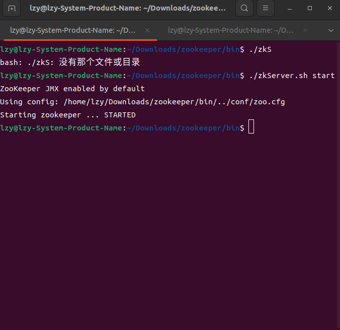
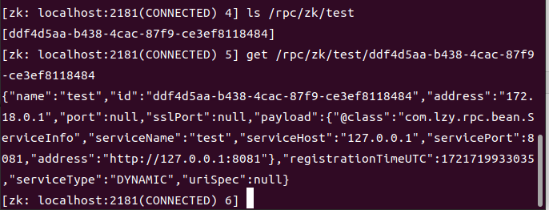

# 服务注册/发现中心的实现

该部分的源码地址：<a href="https://github.com/543211494/MyRpc/tree/MyRpc-registry">https://github.com/543211494/MyRpc/tree/MyRpc-registry</a>

下一章：<a href="./rpc-04.md">负载均衡和SPI机制的实现</a>

## 1.zookeeper的简介

之前版本服务端的`ip`和端口号需要用户自己配置，非常不方便，因此本次更新引入了服务注册/发现中心。

本框架选择使用`Zookeeper`作为服务注册/发现中心。`Zookeeper`是`Apache Hadoop`项目下的一个子项目，是一个树形目录服务。结构类似与文件目录。每个节点可以有子节点，节点上可以存储一定量的数据。

节点有四种类型：

- `PERSISTENT ` 持久化节点
- `EPHEMERAL` 临时节点：`-e`
- `PERSISTENT_SEQUENTIAL` 持久化顺序节点：`-s`
- `EPHEMERAL_SEQUENTIAL` 临时顺序节点：`-es`

以下是`zookeeper`安装方法：

官网下载地址:<a href="https://zookeeper.apache.org/releases.html#download">`https://zookeeper.apache.org/releases.html#download`</a>

将conf文件夹下的zoo_sample.cfg改名为zoo.cfg

```shell
cp zoo_sample.cfg zoo.cfg
#修改配置文件z的dataDir，例如
dataDir=/home/lzy/Downloads/zookeeper/dataDir
```

进入`bin`目录

服务端常用命令：


```shell
#启动zookeeper
./zkServer.sh start
#停止zookeeper
./zkServer.sh stop
#重启zookeeper
./zkServer.sh restart
#查看状态
./zkServer.sh status
```

客户端常用命令：

```shell
#连接服务端
./zkCli.sh -server localhost:2181
#断开连接
quit
#查看
ls
ls -s
#创建节点 create /节点 数据，例如
create /app1 data
#查看数据 get /节点
get /app1
#修改数据 set /节点 数据
set /app1 data1
#删除 delete /节点 
delete /app1
#删除全部子节点 deleteall /节点
deleteall /app1
```

启动`Zookeeper`



## 2.服务注册/发现中心

首先定义一个服务注册中心接口，以供后续拓展

```java
public interface Registry {

    /**
     * 初始化
     */
    void init();

    /**
     * 注册服务（服务端）
     */
    void register(ServiceInfo serviceInfo);

    /**
     * 注销服务（服务端）
     */
    void unRegister(ServiceInfo serviceInfo);

    /**
     * 服务发现（获取某服务的所有节点，消费端）
     */
    List<ServiceInfo> serviceDiscovery(String serviceKey);

    /**
     * 服务销毁
     */
    void destroy();
}
```

再实现该接口：

```java
public class ZooKeeperRegistry implements Registry{

    /**
     * 客户端连接实例
     */
    private CuratorFramework client;

    /**
     * 用于进行服务注册的对象
     */
    private ServiceDiscovery<ServiceInfo> serviceDiscovery;

    /**
     * 根节点
     */
    private static final String ZK_ROOT_PATH = "/rpc/zk";

    @Override
    public void init() {
        RegistryConfig registryConfig = RpcApplication.rpcConfig.getRegistry();
        /**
         * 重试策略
         */
        RetryPolicy retryPolicy = new ExponentialBackoffRetry(registryConfig.getTimeout(),registryConfig.getMaxRetries());
        this.client = CuratorFrameworkFactory
                .builder()
                .connectString(registryConfig.getAddress())
                .retryPolicy(retryPolicy)
                .build();

        // 构建 serviceDiscovery 实例
        this.serviceDiscovery = ServiceDiscoveryBuilder.builder(ServiceInfo.class)
                .client(this.client)
                .basePath(ZooKeeperRegistry.ZK_ROOT_PATH)
                .serializer(new JsonInstanceSerializer<>(ServiceInfo.class))
                .build();
        try {
            client.start();
            serviceDiscovery.start();
        } catch (Exception e) {
            throw new RuntimeException(e);
        }
    }

    @Override
    public void register(ServiceInfo serviceInfo) {
        try {
            /**
             * name为服务的名称,是服务发现的依据
             * payload为节点中存储的数据，即服务的详细信息
             */
            ServiceInstance<ServiceInfo> serviceInstance = ServiceInstance.<ServiceInfo>builder()
                    .name(serviceInfo.getServiceName())
                    .payload(serviceInfo)
                    .build();

            /**
             * 执行序列化后，会在zookeeper的中创建临时节点
             * 临时节点为当前根目录/serviceInstance.name的子节点
             * 临时节点中存储序列化后的serviceInstance
             */
            this.serviceDiscovery.registerService(serviceInstance);
        } catch (Exception e) {
            e.printStackTrace();
        }
    }

    @Override
    public void unRegister(ServiceInfo serviceInfo) {
        try {
            ServiceInstance<ServiceInfo> serviceInstance = ServiceInstance.<ServiceInfo>builder()
                    .name(serviceInfo.getServiceName())
                    .payload(serviceInfo)
                    .build();

            this.serviceDiscovery.unregisterService(serviceInstance);
        } catch (Exception e) {
            e.printStackTrace();
        }
    }

    @Override
    public List<ServiceInfo> serviceDiscovery(String serviceKey) {
        try {
            // 查询服务信息
            Collection<ServiceInstance<ServiceInfo>> serviceInstanceList = serviceDiscovery.queryForInstances(serviceKey);

            // 解析服务信息
            List<ServiceInfo> list = serviceInstanceList.stream()
                    .map(ServiceInstance::getPayload)
                    .collect(Collectors.toList());
            return list;
        } catch (Exception e) {
            e.printStackTrace();
        }
        return null;
    }

    @Override
    public void destroy() {
        if(this.client!=null){
            this.client.close();
        }
    }
}
```

服务端在启动时会将自己的信息注册到`Zookeeper`，具体来说是路径`/rpc/zk/当前服务名称`下的一个临时节点，使用临时节点有一个好处，如果连接意外断开，临时节点会被删除。节点中存储的数据即为当前服务的各项信息，如下图所示：



当客户端想要调用服务时，会使用服务名向`Zookeeper`获取服务端`ip`和端口号，从而向服务端调用服务。如果有多个提供相同服务的服务端向`Zookeeper`注册，那么客户端会获得一个服务端信息列表，该如何选择呢？目前默认选择第一个，后续的负载均衡策略会解决这个问题。

客户端在调用服务前会先向`Zookeeper`请求服务端信息：

```java
public class ServiceProxy implements InvocationHandler {

    private static final Serializer serializer = new JdkSerializer();

    @Override
    public Object invoke(Object proxy, Method method, Object[] args) throws Throwable {
        RpcRequest rpcRequest = new RpcRequest();
        String serviceName = method.getDeclaringClass().getName();
        /* 不能用完整路径,得用接口名 */
        serviceName = serviceName.substring(serviceName.lastIndexOf('.')+1);
        rpcRequest.setServiceName(serviceName);
        rpcRequest.setMethodName(method.getName());
        rpcRequest.setParameterTypes(method.getParameterTypes());
        rpcRequest.setArgs(args);

        try {
            // 序列化
            byte[] data = serializer.serialize(rpcRequest);
            // 发送请求
            String url = RpcApplication.rpcConfig.getClient().getAddress();
            if(RpcApplication.registry!=null){
                List<ServiceInfo> services = RpcApplication.registry.serviceDiscovery(RpcApplication.rpcConfig.getClient().getServiceName());
                /**
                 * 此处待实现负载均衡
                 */
                if(services!=null&&!services.isEmpty()){
                    url = services.get(0).getAddress();
                }
            }
            try (HttpResponse httpResponse = HttpRequest.post(url)
                    .body(data)
                    .execute()) {
                byte[] result = httpResponse.bodyBytes();
                // 反序列化
                RpcResponse rpcResponse = serializer.deserialize(result, RpcResponse.class);
                return rpcResponse.getData();
            }
        } catch (IOException e) {
            e.printStackTrace();
        }
        return null;
    }
}
```


## 3.配置类调整

本次新增了服务注册中心相关配置，用户可自行在`application.properties`文件中配置，并可选择开启/关闭服务注册中心。若关闭注册中心，则需在配置文件中配置服务端`ip`和端口进行连接。随着配置信息增多，为方面使用，对配置信息进行了调整，分为客户端使用部分和服务端使用部分。

### 3.1服务端配置信息

```properties
#服务端地址，用于向注册中心注册
rpc.server.host=127.0.0.1
#服务端服务名称，用于向注册中心注册
rpc.server.serviceName=test
#服务端端口
rpc.server.port=8081
#是否启用注册中心
rpc.useRegistry=true
#注册中心地址
rpc.registry.host=127.0.0.1
#注册中心端口号
rpc.registry.port=2181
#连接注册中心超时时间，单位毫秒
rpc.registry.timeout=10000
#连接注册中心最大重试次数
rpc.registry.maxRetries=3
```

### 3.2客户端配置信息

```properties
#要连接的服务端服务名称，用于向注册中心发现服务
rpc.client.serviceName=test
#要连接的服务端地址，用于不启用注册中心时连接服务端
rpc.client.serverHost=127.0.0.1
#要连接的服务端端口号，用于不启用注册中心时连接服务端
rpc.client.serverPort=8081
#是否启用注册中心
rpc.useRegistry=true
#注册中心地址
rpc.registry.host=127.0.0.1
#注册中心端口号
rpc.registry.port=2181
#连接注册中心超时时间，单位毫秒
rpc.registry.timeout=10000
#连接注册中心最大重试次数
rpc.registry.maxRetries=3
```

## 4.启动方法

项目为标准的`Maven`项目

`provider`下为服务端代码，执行其中的`main`函数即可启动服务端，服务端启动方式如下

```java
public static void main(String[] args) {
    ProviderBootstrap.run();
}
```

目前服务端以实现了自动注解和读取配置文件`application.properties`

只需要在实现接口的类上加上注解`@RpcService`即可自动注册，无需手动注册，例如

```java
@RpcService
public class CalculatorServiceImpl implements CalculatorService {

    @Override
    public int add(int a, int b) {
        return a+b;
    }
}
```

`consumer`文件夹下为客户端代码，通过代理工厂获取代理类，从而调用服务端的远程方法

```java
public static void main(String[] args) {
    ConsumerBootstrap.init();
    CalculatorService calculatorService = ServiceProxyFactory.getProxy(CalculatorService.class);
    System.out.println(calculatorService.add(1,2));
}
```

## 附录：项目文件结构

```
.
├── common    公共接口，用于演示用法
│   ├── pom.xml
│   └── src
│       ├── main
│       │   └── java
│       │       └── com
│       │           └── lzy
│       │               └── common
│       │                   └── CalculatorService.java
│       └── test
│           └── java
├── consumer   客户端，用于演示用法
│   ├── pom.xml
│   └── src
│       ├── main
│       │   ├── java
│       │   │   └── com
│       │   │       └── lzy
│       │   │           └── consumer
│       │   │               └── Main.java
│       │   └── resources
│       │       └── application.properties
│       └── test
│           └── java
├── pom.xml
├── provider   服务端，用于演示用法
│   ├── pom.xml
│   └── src
│       ├── main
│       │   ├── java
│       │   │   └── com
│       │   │       └── lzy
│       │   │           └── provider
│       │   │               ├── CalculatorServiceImpl.java
│       │   │               └── Main.java
│       │   └── resources
│       │       └── application.properties
│       └── test
│           └── java
├── README.md
└── rpc-core
    ├── pom.xml
    └── src
        ├── main
        │   ├── java
        │   │   └── com
        │   │       └── lzy
        │   │           └── rpc
        │   │               ├── anno  注解
        │   │               │   └── RpcService.java    用于实例化服务提供类的注解
        │   │               ├── bean  实体类
        │   │               │   ├── RpcRequest.java    RPC请求实体类
        │   │               │   ├── RpcResponse.java   RPC回复实体类
        │   │               │   └── ServiceInfo.java   服务端注册信息实体类
        │   │               ├── bootstrap  客户端/服务端启动类
        │   │               │   ├── ConsumerBootstrap.java
        │   │               │   └── ProviderBootstrap.java
        │   │               ├── config
        │   │               │   ├── ClientConfig.java    客户端配置类
        │   │               │   ├── Constant.java        常数类
        │   │               │   ├── RegistryConfig.java  注册中心配置类
        │   │               │   ├── RpcConfig.java       总配置类，存放所有配置类
        │   │               │   └── ServerConfig.java    服务端配置类
        │   │               ├── consumer   客户端调用部分
        │   │               │   └── proxy  客户端代理类及代理工厂
        │   │               │       ├── ServiceProxyFactory.java
        │   │               │       └── ServiceProxy.java
        │   │               ├── provider
        │   │               │   ├── registry
        │   │               │   │   ├── LocalRegistry.java   本地对象注册中心
        │   │               │   │   ├── Registry.java        注册中心接口
        │   │               │   │   └── ZooKeeperRegistry.java   zookeeper注册中心操作类
        │   │               │   └── server  netty服务器
        │   │               │       ├── NettyRpcServer.java
        │   │               │       └── NettyServerHandler.java
        │   │               ├── RpcApplication.java  存储配置类实例和注册中心类实例
        │   │               └── util   工具类
        │   │                   ├── ConfigUtil.java     配置加载类
        │   │                   ├── JdkSerializer.java  jdk序列化类
        │   │                   └── Serializer.java     序列化接口
        │   └── resources
        │       └── log4j.properties  日志配置文件(用于关闭curator日志打印)
        └── test
            └── java
```