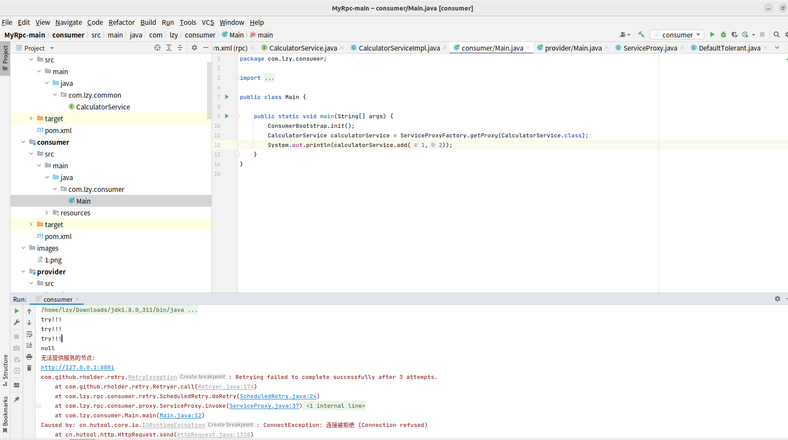

# 重试和容错机制的实现

该部分的源码地址：<a href="https://github.com/543211494/MyRpc/tree/main">https://github.com/543211494/MyRpc/tree/main</a>

## 1.重试机制

重试机制，即客户端请求服务失败后根据重试策略重新请求，重试机制也使用了`SPI`进行拓展，通过`Guava Retrying`实现了重试，目前实现了不重试和定时重试两种重试策略。

首先定义重试接口：

```java
public interface Retry {

    RpcResponse doRetry(Callable<RpcResponse> callable) throws Exception;
}
```

以下定时重试的具体实现：

```java
public class ScheduledRetry implements Retry{
    @Override
    public RpcResponse doRetry(Callable<RpcResponse> callable) throws Exception {
        Retryer<RpcResponse> retryer = RetryerBuilder.<RpcResponse>newBuilder()
                .retryIfExceptionOfType(Exception.class) //发生异常时重试
                .retryIfRuntimeException()  //发生运行时异常时重试
                .withWaitStrategy(WaitStrategies.fixedWait(2L, TimeUnit.SECONDS)) //每次重试之间等待2秒钟
                .withStopStrategy(StopStrategies.stopAfterAttempt(3))  //尝试3次后停止
                .build();
        return retryer.call(callable);
    }
}
```

对客户端发送请求的部分进行修改，将其封装为一个`Callable`传入重试对象进行执行：

```java
public class ServiceProxy implements InvocationHandler {

    private static final Serializer serializer = new JdkSerializer();

    @Override
    public Object invoke(Object proxy, Method method, Object[] args) throws Throwable {
        RpcRequest rpcRequest = new RpcRequest();
        String serviceName = method.getDeclaringClass().getName();
        /* 不用完整路径,得用接口名 */
        serviceName = serviceName.substring(serviceName.lastIndexOf('.')+1);
        rpcRequest.setServiceName(serviceName);
        rpcRequest.setMethodName(method.getName());
        rpcRequest.setParameterTypes(method.getParameterTypes());
        rpcRequest.setArgs(args);
        Set<String> urls = new HashSet<>();
        try {
            RpcResponse rpcResponse = RpcApplication.retry.doRetry(new Callable<RpcResponse>() {
                @Override
                public RpcResponse call() throws Exception {
                    System.out.println("try!!!");
                    /* 获取服务url */
                    String url = RpcApplication.rpcConfig.getClient().getAddress();
                    if(RpcApplication.registry!=null){
                        List<ServiceInfo> services = RpcApplication.registry.serviceDiscovery(RpcApplication.rpcConfig.getClient().getServiceName());
                        /**
                         * 使用选定的负载均衡策略选择服务
                         */
                        if(services!=null&&!services.isEmpty()){
                            url = RpcApplication.loadBalancer.select(services).getAddress();
                        }
                    }
                    //System.out.println(url);
                    /* 记录请求过的url */
                    urls.add(url);
                    /* 序列化 */
                    byte[] data = serializer.serialize(rpcRequest);
                    /* 发送请求 */
                    HttpResponse httpResponse = HttpRequest.post(url)
                            .body(data)
                            .execute();
                    byte[] result = httpResponse.bodyBytes();
                    /* 反序列化 */
                    return serializer.deserialize(result, RpcResponse.class);
                }
            });
            return rpcResponse.getData();
        } catch (Exception e) {
            return RpcApplication.tolerant.tolerant(new ArrayList<>(urls),e);
        }
    }
}
```

将服务端关闭，启动客户端，重试了三次，每次请求都打印一次，结果如下所示：



`null`之后的输出为容错机制输出

## 2.容错机制

虽然已经有了重试机制，但重试超过了一定次数仍然失败，此时需要执行容错机制

常见容错机制有：故障转移、静默处理、快速失败等

目前实现的默认容错机制会打印无法提供服务的地址和错误信息，然后做打印错误信息

```java
public class DefaultTolerant implements Tolerant{

    @Override
    public RpcResponse tolerant(List<String> urls, Exception e) {
        if(urls!=null&&!urls.isEmpty()){
            System.err.println("无法提供服务的节点:");
            for(int i = 0;i<urls.size();i++){
                System.err.println(urls.get(i));
            }
        }
        e.printStackTrace();
        return null;
    }
}
```

## 3.配置信息

配置信息写于`resource`文件夹下的`application.properties`文件中，目前版本更新了一些配置参数，以下是详细介绍：

### 3.1服务端配置信息

```properties
#服务端地址，用于向注册中心注册
rpc.server.host=127.0.0.1
#服务端服务名称，用于向注册中心注册
rpc.server.serviceName=test
#服务端端口
rpc.server.port=8081
#服务权重
rpc.server.weight=1
#是否启用注册中心
rpc.useRegistry=true
#注册中心地址
rpc.registry.host=127.0.0.1
#注册中心端口号
rpc.registry.port=2181
#连接注册中心超时时间，单位毫秒
rpc.registry.timeout=5000
#连接注册中心最大重试次数
rpc.registry.maxRetries=3
```

### 3.2客户端配置信息

```properties
#要连接的服务端服务名称，用于向注册中心发现服务
rpc.client.serviceName=test
#要连接的服务端地址，用于不启用注册中心时连接服务端
rpc.client.serverHost=127.0.0.1
#要连接的服务端端口号，用于不启用注册中心时连接服务端
rpc.client.serverPort=8081
#负载均衡策略，目前支持random、weightedRandom、roundRobin三种负载均衡策略
rpc.client.loadBalancerPolicy=random
#重试策略，目前支持no、scheduledRetry两种重试策略
rpc.client.retry=scheduledRetry
#容错策略，目前只实现了一种容错策略
rpc.client.tolerant=default
#是否启用注册中心
rpc.useRegistry=true
#注册中心地址
rpc.registry.host=127.0.0.1
#注册中心端口号
rpc.registry.port=2181
#连接注册中心超时时间，单位毫秒
rpc.registry.timeout=5000
#连接注册中心最大重试次数
rpc.registry.maxRetries=3
```

## 4.启动方法

项目为标准的`Maven`项目

`provider`下为服务端代码，执行其中的`main`函数即可启动服务端，服务端启动方式如下

```java
public static void main(String[] args) {
    ProviderBootstrap.run();
}
```

目前服务端以实现了自动注解和读取配置文件`application.properties`

只需要在实现接口的类上加上注解`@RpcService`即可自动注册，无需手动注册，例如

```java
@RpcService
public class CalculatorServiceImpl implements CalculatorService {

    @Override
    public int add(int a, int b) {
        return a+b;
    }
}
```

`consumer`文件夹下为客户端代码，通过代理工厂获取代理类，从而调用服务端的远程方法

```java
public static void main(String[] args) {
    ConsumerBootstrap.init();
    CalculatorService calculatorService = ServiceProxyFactory.getProxy(CalculatorService.class);
    System.out.println(calculatorService.add(1,2));
}
```

## 附录：项目文件结构

```
.
├── common    公共接口，用于演示用法
│   ├── pom.xml
│   └── src
│       └── main
│           └── java
│               └── com
│                   └── lzy
│                       └── common
│                           └── CalculatorService.java
├── consumer   客户端，用于演示用法
│   ├── pom.xml
│   └── src
│       └── main
│           ├── java
│           │   └── com
│           │       └── lzy
│           │           └── consumer
│           │               └── Main.java
│           └── resources
│               └── application.properties
├── pom.xml
├── provider   服务端，用于演示用法
│   ├── pom.xml
│   └── src
│       └── main
│           ├── java
│           │   └── com
│           │       └── lzy
│           │           └── provider
│           │               ├── CalculatorServiceImpl.java
│           │               └── Main.java
│           └── resources
│               └── application.properties
├── README.md
└── rpc-core
    ├── pom.xml
    └── src
        ├── main
        │   ├── java
        │   │   └── com
        │   │       └── lzy
        │   │           └── rpc
        │   │               ├── anno  注解
        │   │               │   └── RpcService.java    用于实例化服务提供类的注解
        │   │               ├── bean
        │   │               │   ├── RpcRequest.java    RPC请求实体类
        │   │               │   ├── RpcResponse.java   RPC回复实体类
        │   │               │   └── ServiceInfo.java   服务端注册信息实体类
        │   │               ├── bootstrap
        │   │               │   ├── ConsumerBootstrap.java   客户端启动类
        │   │               │   └── ProviderBootstrap.java   服务端启动类
        │   │               ├── config
        │   │               │   ├── ClientConfig.java    客户端配置类
        │   │               │   ├── Constant.java        常数类
        │   │               │   ├── RegistryConfig.java  注册中心配置类
        │   │               │   ├── RpcConfig.java       总配置类，存放所有配置类
        │   │               │   └── ServerConfig.java    服务端配置类
        │   │               ├── consumer   客户端调用部分
        │   │               │   └── proxy  客户端代理类及代理工厂
        │   │               │   │   ├── ServiceProxyFactory.java   代理工厂类
        │   │               │   │   └── ServiceProxy.java          客户端代理类
        │   │               │   ├── retry
        │   │               │   │   ├── NoRetry.java           不重试策略实现类
        │   │               │   │   ├── Retry.java             重试策略接口
        │   │               │   │   ├── RetryPolicy.java       标识重试策略的常量
        │   │               │   │   └── ScheduledRetry.java    定时重试策略实现类
        │   │               │   └── tolerant
        │   │               │       ├── DefaultTolerant.java   默认容错策略实现类
        │   │               │       ├── Tolerant.java          容错策略接口
        │   │               │       └── TolerantPolicy.java    标识容错策略的常量
        │   │               ├── loadbalancer
        │   │               │   ├── LoadBalancer.java               负载均衡接口
        │   │               │   ├── LoadBalancerPolicy.java         标识负载均衡策略的常量
        │   │               │   ├── RandomLoadBalancer.java         随机负载均衡实现
        │   │               │   ├── RoundRobinLoadBalancer.java     带权重的随机负载均衡实现
        │   │               │   └── WeightedRandomLoadBalancer.java 轮询负载均衡实现
        │   │               ├── provider
        │   │               │   ├── registry
        │   │               │   │   ├── LocalRegistry.java   本地对象注册中心
        │   │               │   │   ├── Registry.java        注册中心接口
        │   │               │   │   └── ZooKeeperRegistry.java   zookeeper注册中心操作类
        │   │               │   └── server  netty服务器
        │   │               │       ├── NettyRpcServer.java
        │   │               │       └── NettyServerHandler.java
        │   │               ├── RpcApplication.java   存储配置类实例和注册中心类实例
        │   │               └── util
        │   │                   ├── ConfigUtil.java     配置加载类
        │   │                   ├── JdkSerializer.java  jdk序列化类
        │   │                   ├── Serializer.java     序列化接口
        │   │                   └── SpiLoader.java      spi加载器
        │   └── resources
        │       ├── log4j.properties  日志配置文件(用于关闭curator日志打印)
        │       └── META-INF
        │           └── rpc
        │               └── spi.properties   spi配置文件
        └── test
            └── java
```
